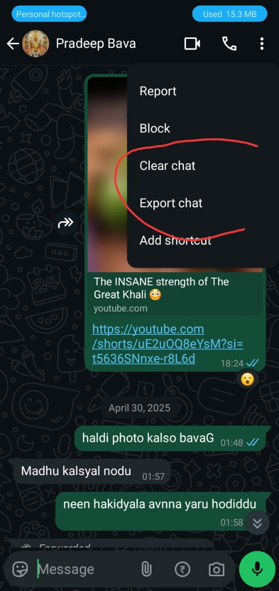
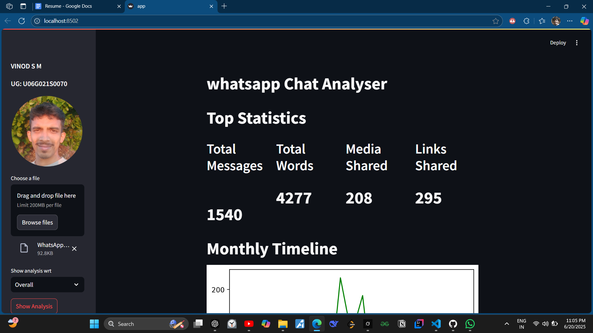
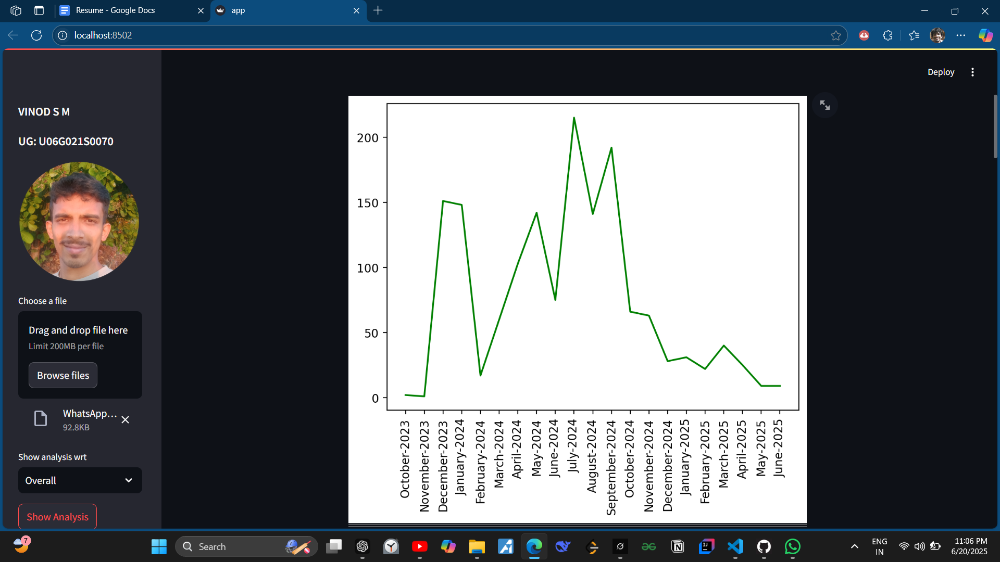
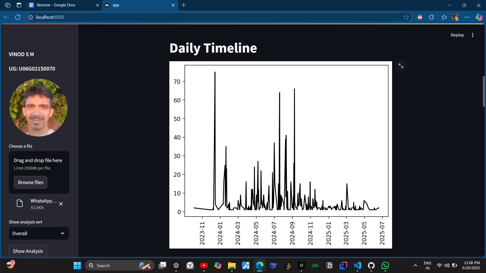
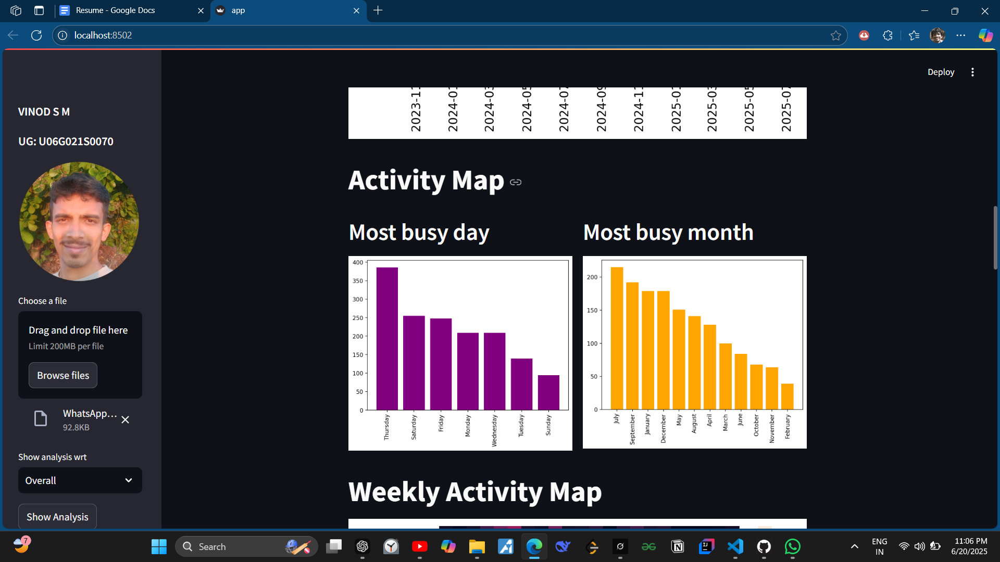
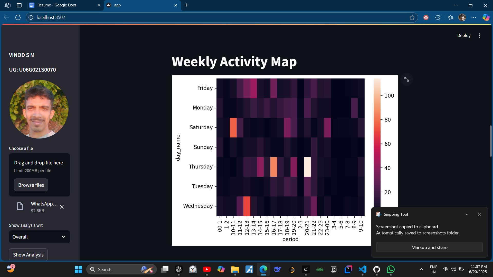
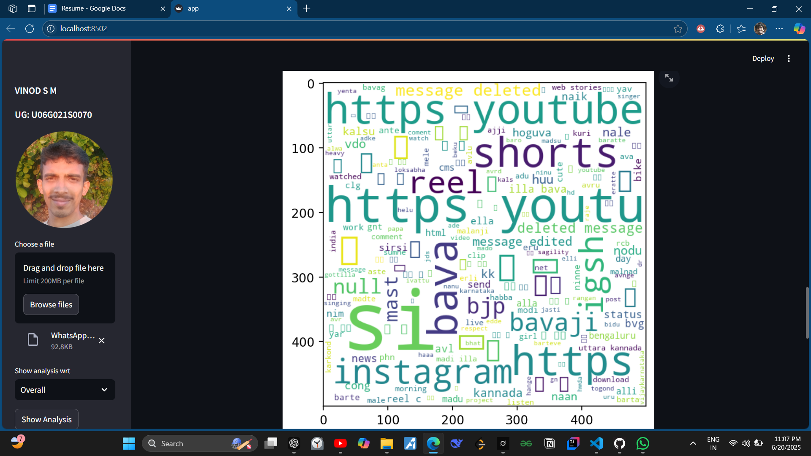
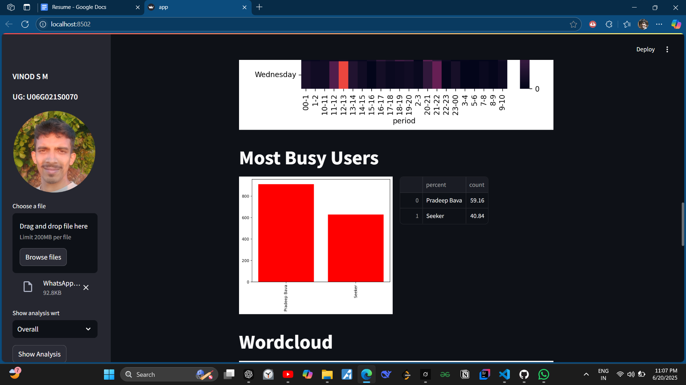
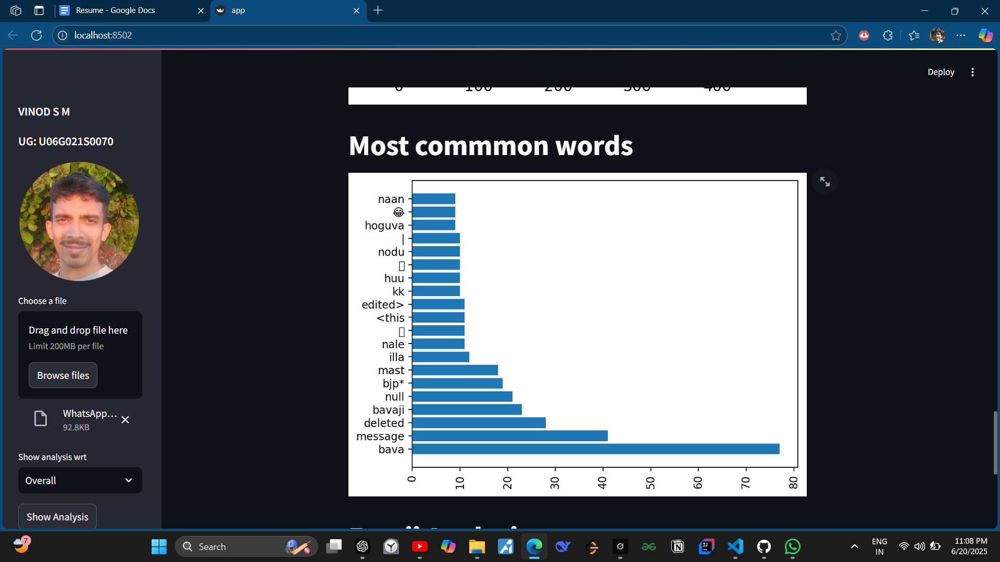
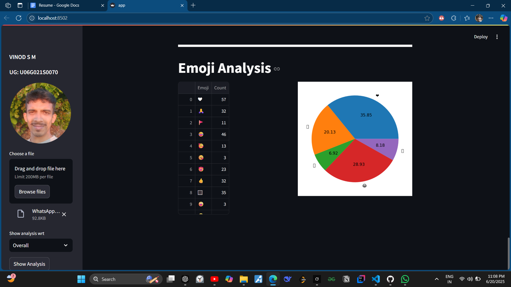

# 📊 WhatsApp Chat Analyzer

A powerful Python-based analyzer that processes exported WhatsApp chat `.txt` files and generates detailed statistics, visualizations, and insights about the conversation patterns using **Streamlit**.

---

## 📌 Features

- 📂 Upload WhatsApp chat files (text format)
- 🔍 Analyze messages per user or overall
- 📅 Monthly and daily message timeline
- 📆 Weekly activity heatmap
- 💬 Most common words
- 🤖 Word cloud generation
- 😂 Emoji usage breakdown
- 🧍 Busy users detection
- 📈 Interactive visualizations via Streamlit

---

## 🚀 Demo Flow (with Screenshots)

### 1. Export WhatsApp Chat from Phone  
Users begin by exporting their WhatsApp chat from their phone.



---

### 2. Upload File in Our App  
After export, the user uploads the `.txt` file to our Streamlit web application.
### Choode the individual person in group chat or overall for the overall analysis


# 


---

### 3. Message Statistics  
See total messages, media shared, links, and more.



---

### 4. Monthly Timeline  
A line chart showing activity across months.



---

### 5. Daily Timeline  
A graph of messages sent daily.



---

### 6. Busy Day & Month Activity  
Identify most active days and months.



---

### 7. Weekly Heatmap  
A heatmap showing message frequency across weekdays and hours.



---

### 8. Word Cloud  
Visually see the most frequent words used in the chat.



---

### 9. Busy Users  
List of users who sent the most messages.



---

### 10. Most Common Words  
Bar chart of top used words in the chat.



---

### 11. Emoji Analysis  
Breakdown of emoji usage in the conversation.



---

## 🛠️ Tech Stack

| Tool        | Purpose                        |
|-------------|--------------------------------|
| Python      | Core Programming Language      |
| Streamlit   | Web Interface                  |
| pandas      | Data Handling                  |
| matplotlib  | Plotting Graphs                |
| seaborn     | Statistical Visualization      |
| wordcloud   | Word Cloud Generation          |
| emoji       | Emoji Extraction & Count       |
| urlextract  | URL Extraction from Messages   |

---

## 📦 Setup Instructions

1. Clone the repository:
   ```bash
   git clone https://github.com/your-username/Whatsapp-Chat-Analyser.git
   cd Whatsapp-Chat-Analyser
pip install -r requirements.txt

streamlit run app.py

## Folder Structure
Whatsapp-Chat-Analyser/
│
├── app.py
├── helper.py
├── preprocessor.py
├── requirements.txt
├── README.md
├── stop_hinglish.txt
├── screenShots/
│   ├── exportChat.jpg
│   ├── uploadAndUser.png
│   ├── messageStatistics.png
│   ├── mothlyTimeline.png
│   ├── DailyTimeline.png
│   ├── busyDayMonth.png
│   ├── weeklyHeatmap.png
│   ├── WorldCloud.png
│   ├── BusyUser.png
│   ├── commonWords.png
│   └── emoji.png


